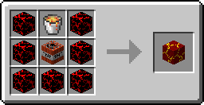

# Blast Blox

The Blast Blox is a Bug Blox which acts similarly to TNT, however it is far more dangerous where any contact with the block will cause it to explode. The only way to break it without it exploding is by destroying it with a feather.

# Crafting

| |Crafting |
:- | :-: | -:
[Normal Blox](normalblox.md)|[Lava Bucket](http://minecraft.gamepedia.com/Lava)|[Normal Blox](normalblox.md)
[Normal Blox](normalblox.md)|[TNT](http://minecraft.gamepedia.com/TNT)|[Normal Blox](normalblox.md)
[Normal Blox](normalblox.md)|[Normal Blox](normalblox.md)|[Normal Blox](normalblox.md)