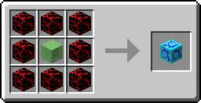

# Bounce Blox

The Bounce Blox are Bug Blox that act similarly to [Slime Blocks](http://minecraft.gamepedia.com/Slime_Block) however the height of the bounce does not require to fall onto the block, when an entity touches multiple Bounce Blox the jump height is multiplied by how many they are touching, this means that the player will bounce 4x the height of 1 Bounce Blox. Entities with larger bounding boxes may be able to bounce even higher. The player will not take fall damage and will not stop bouncing as long as they land on a Bounce Blox so [Water](http://minecraft.gamepedia.com/Water) or [Slime Blocks](http://minecraft.gamepedia.com/Slime_Block) may want to be used in conjunction with the Bounce Blox.

# Crafting

<map name="items">
    <area shape="rect" coords="14,14,46,46" href="normalblox">
    <area shape="rect" coords="50,14,82,46" href="normalblox">
    <area shape="rect" coords="86,14,118,46" href="normalblox">
    
    <area shape="rect" coords="14,50,46,82" href="normalblox">
    <area shape="rect" coords="50,50,82,82" href="http://minecraft.gamepedia.com/Slime_Block">
    <area shape="rect" coords="86,50,118,82" href="normalblox">
    
    <area shape="rect" coords="14,86,46,118" href="normalblox">
    <area shape="rect" coords="50,86,82,118" href="normalblox">
    <area shape="rect" coords="86,86,118,118" href="normalblox">
    
    <area shape="rect" coords="194,42,242,90" href="bounceblox">
</map>
