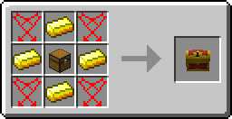
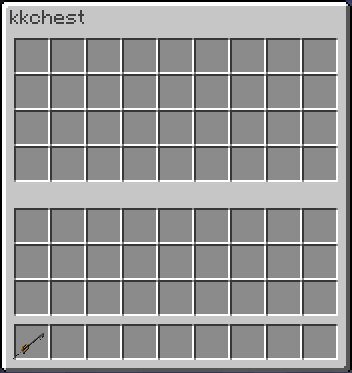

# Chest

The Chest is a [chest](http://minecraft.gamepedia.com/Chest) that is opened using a [Keyblade](../keyblades/keyblades), when opening the Chest with a [Keyblade](../keyblades/keyblades) it is locked using that [Keyblade](../keyblades/keyblades) and must be opened using that [Keyblade](../keyblades/keyblades).
The GUI has 36 slots

# Crafting

<map name="items">
    <area shape="rect" coords="14,14,46,46" href="../items/heart">
    <area shape="rect" coords="50,14,82,46" href="http://minecraft.gamepedia.com/Gold_Ingot">
    <area shape="rect" coords="86,14,118,46" href="../items/heart">
    
    <area shape="rect" coords="14,50,46,82" href="http://minecraft.gamepedia.com/Gold_Ingot">
    <area shape="rect" coords="50,50,82,82" href="http://minecraft.gamepedia.com/Chest">
    <area shape="rect" coords="86,50,118,82" href="http://minecraft.gamepedia.com/Gold_Ingot">
    
    <area shape="rect" coords="14,86,46,118" href="../items/heart">
    <area shape="rect" coords="50,86,82,118" href="http://minecraft.gamepedia.com/Gold_Ingot">
    <area shape="rect" coords="86,86,118,118" href="../items/heart">
    
    <area shape="rect" coords="194,42,242,90" href="chest">
</map>

# Interface

