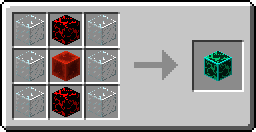
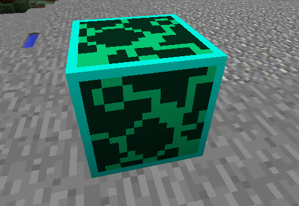
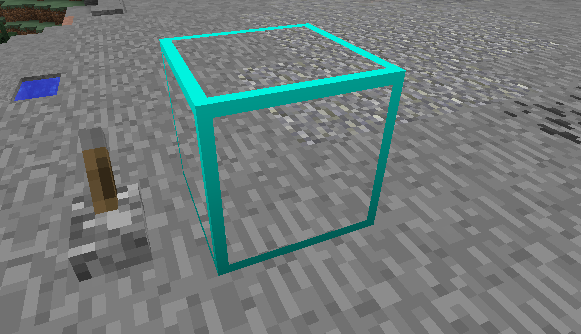

# Ghost Blox

Ghost Blox are Bug Blox that become "invisible" when provided with redstone power. While they are in the "invisible" state the border of the texture is only visible allowing for the player to see through the block, they have no collision and cannot be destroyed by punching the block. In the "visible" state they act just like a normal block.

# Crafting

<map name="items">
    <area shape="rect" coords="14,14,46,46" href="http://minecraft.gamepedia.com/Glass">
    <area shape="rect" coords="50,14,82,46" href="normalblox">
    <area shape="rect" coords="86,14,118,46" href="http://minecraft.gamepedia.com/Glass">
    
    <area shape="rect" coords="14,50,46,82" href="http://minecraft.gamepedia.com/Glass">
    <area shape="rect" coords="50,50,82,82" href="http://minecraft.gamepedia.com/Slime_Block">
    <area shape="rect" coords="86,50,118,82" href="http://minecraft.gamepedia.com/Glass">
    
    <area shape="rect" coords="14,86,46,118" href="http://minecraft.gamepedia.com/Glass">
    <area shape="rect" coords="50,86,82,118" href="normalblox">
    <area shape="rect" coords="86,86,118,118" href="http://minecraft.gamepedia.com/Glass">
    
    <area shape="rect" coords="194,42,242,90" href="ghostblox">
</map>

# Screenshots

<table class="image">
<caption align="bottom">Ghost Blox in its "visible" state</caption>
<tr><td></td></tr>
</table>

<table class="image">
<caption align="bottom">Ghost Blox in its "invisible" state</caption>
<tr><td></td></tr>
</table>