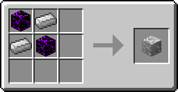
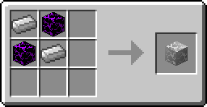

# Metal Blox

Metal Blox are Bug Blox that are as resistant to explosion as [Obsidian](http://minecraft.gamepedia.com/Obsidian) but can be destroyed with an [Iron Pickaxe](http://minecraft.gamepedia.com/Pickaxe) or greater in much less time. They can be found in [Bug Blox Veins](../worldgen/bugbloxveins).

# Crafting

<map name="items">
    <area shape="rect" coords="14,14,46,46" href="hardblox">
    <area shape="rect" coords="50,14,82,46" href="http://minecraft.gamepedia.com/Iron_Ingot">
    
    <area shape="rect" coords="14,50,46,82" href="http://minecraft.gamepedia.com/Iron_Ingot">
    <area shape="rect" coords="50,50,82,82" href="hardblox">
    
    <area shape="rect" coords="194,42,242,90" href="metalblox">
</map>

<map name="items2">
    <area shape="rect" coords="14,14,46,46" href="http://minecraft.gamepedia.com/Iron_Ingot">
    <area shape="rect" coords="50,14,82,46" href="hardblox">
    
    <area shape="rect" coords="14,50,46,82" href="hardblox">
    <area shape="rect" coords="50,50,82,82" href="http://minecraft.gamepedia.com/Iron_Ingot">
    
    <area shape="rect" coords="194,42,242,90" href="metalblox">
</map>