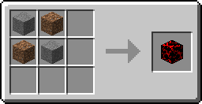
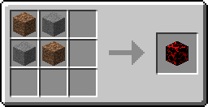

# Normal Blox

Normal Blox are a Bug Blox that are used as crafting materials and can be found in [Bug Blox Veins](../worldgen/bugbloxveins)

# Crafting

<map name="items">
    <area shape="rect" coords="14,14,46,46" href="http://minecraft.gamepedia.com/Stone">
    <area shape="rect" coords="50,14,82,46" href="http://minecraft.gamepedia.com/Dirt">
    
    <area shape="rect" coords="14,50,46,82" href="http://minecraft.gamepedia.com/Dirt">
    <area shape="rect" coords="50,50,82,82" href="http://minecraft.gamepedia.com/Stone">
    
    <area shape="rect" coords="194,42,242,90" href="normalblox">
</map>

<map name="items2">
    <area shape="rect" coords="14,14,46,46" href="http://minecraft.gamepedia.com/Dirt">
    <area shape="rect" coords="50,14,82,46" href="http://minecraft.gamepedia.com/Stone">
    
    <area shape="rect" coords="14,50,46,82" href="http://minecraft.gamepedia.com/Stone">
    <area shape="rect" coords="50,50,82,82" href="http://minecraft.gamepedia.com/Dirt">
    
    <area shape="rect" coords="194,42,242,90" href="normalblox">
</map>