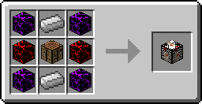

# Synthesis Table

The synthesis table is an essential block in Kingdom Keys, used to create almost every keyblade in the mod. They require recipes and the materials required by the recipe to synthesize.

## Crafting

They can be crafted like so:

<map name="items">
    <area shape="rect" coords="14,14,46,46" href="hardblox">
    <area shape="rect" coords="50,14,82,46" href="http://minecraft.gamepedia.com/Iron_Ingot">
    <area shape="rect" coords="86,14,118,46" href="hardblox">
    
    <area shape="rect" coords="14,50,46,82" href="normalblox">
    <area shape="rect" coords="50,50,82,82" href="http://minecraft.gamepedia.com/Crafting_Table">
    <area shape="rect" coords="86,50,118,82" href="normalblox">
    
    <area shape="rect" coords="14,86,46,118" href="hardblox">
    <area shape="rect" coords="50,86,82,118" href="http://minecraft.gamepedia.com/Iron_Ingot">
    <area shape="rect" coords="86,86,118,118" href="hardblox">
    
    <area shape="rect" coords="194,42,242,90" href="synthesistable">
</map>

## Interface

Right click to open the interface.

When opening the interface you will be greeted with 3 buttons:

* Synthesis
* Free Development
* Materials

The "Synthesis" button will open the synthesis recipe list. You will start with this list being empty, to get recipes you will need to find [Recipes](../items/recipe.md).
The "Free Development" button will open the free development recipe list. This list will already be populated with every free development recipe.
The "Materials" button will open the list of synthesis materials. You will start with this list being empty, to get materials you will have to find [Synthesis Materials](../items/synthesismaterials.md).

## Adding/removing synthesis materials to/from the table

Once you have some Synthesis Materials in your inventory they can be deposited into the synthesis table by going to the list of synthesis materials and clicking the "Deposit Materials" button.
If you want to take a material out of the table select the material from the list and click either "Take 1", "Take half stack", "Take stack" or "Take all". Clicking a button that would take more than what you have will just take as many as you have.

## Creating items in the table

To create an item in the synthesis table select the recipe for the item you want to create. This will bring up a panel on the side which shows a list of the required materials needed to create it.
If you have all the required materials you can click the "Create" button to create the item. If your inventory is full it will not let you create the item.