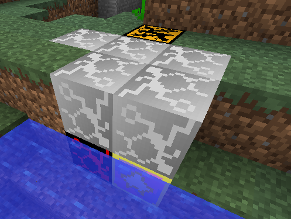

# Bug Blox Veins

In the overworld veins of various different types of Bug Blox generate on the surface this includes [Normal Blox](../blocks/normalblox), [Hard Blox](../blocks/hardblox), [Metal Blox](../blocks/metalblox), [Danger Blox](../blocks/dangerblox), [Prize Blox](../blocks/prizeblox) and [Rare Prize Blox](../blocks/rareprizeblox)

This is the only way Danger Blox, Prize Blox and Rare Prize Blox are found.

<table class="image">
<caption align="bottom">A Bug Blox Vein containing Normal Blox, Hard Blox and Danger Blox</caption>
<tr><td></td></tr>
</table>

<table class="image">
<caption align="bottom">A Bug Blox Vein containing Normal Blox, Hard Blox, Metal Blox and Danger Blox</caption>
<tr><td></td></tr>
</table>

<table class="image">
<caption align="bottom">A Bug Blox Vein containing Hard Blox, Metal Blox, Prize Blox and Danger Blox</caption>
<tr><td></td></tr>
</table>

<table class="image">
<caption align="bottom">A Bug Blox Vein containing Normal Blox, Hard Blox and Danger Blox in The End</caption>
<tr><td></td></tr>
</table>